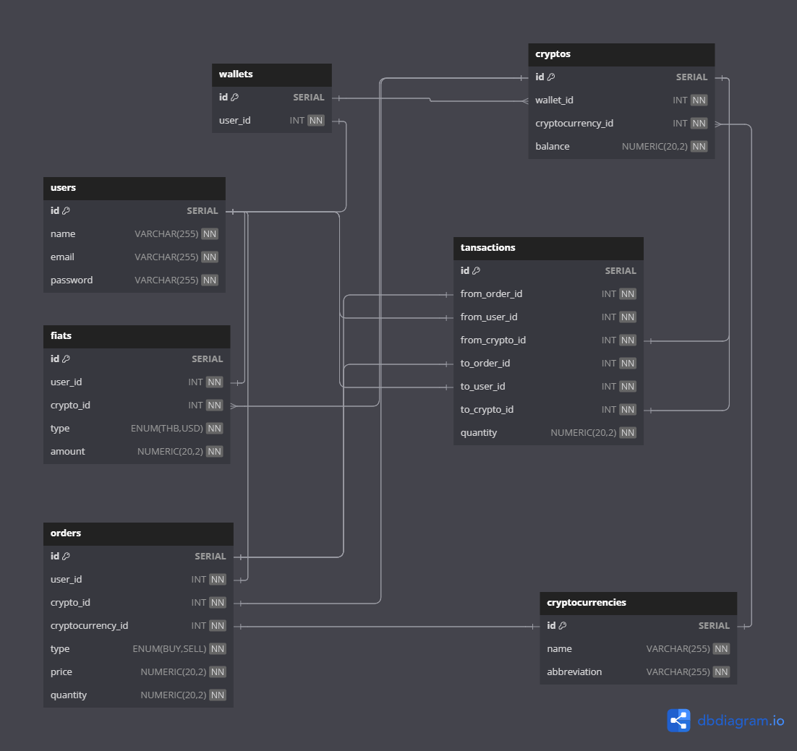

## ข้อสอบ BackEnd
### Requirements
1. postgreSQL (หรือ สามารถดูใน solutions.txt ในที่นี้ใช้ docker image run postgres)
2. การตั้งค่าตาม .env ไฟล์ root folder ของโปรเจค
3. PostMan สามารถ Import จากไฟล์ skuberg.postman_collection.json
4. ERDiagram อยู่ใน โฟลเดอร์ ../ERDiagram หรือ ดูรูปด้านล่างใน Readme.me

### วิธี run
#### 1.
```bash
npm install
```

#### 2. db_migration 
```bash
npx sequelize-cli db:migrate
```

#### 3. seeders
```bash
npx sequelize-cli db:seed:all
```

#### 4.
```bash
npm run dev
```

#### 5.
ทำการ Create User ผ่าน Postman http://localhost:3000/api/createUser
```bash
{
    "Name": "test",
    "Email": "test@test.com",
    "Password": "test"
}
```
#### 6.
ทำการ Create Order ผลลัพธ์จะ Flow ตาม Controller ที่ได้เขียนไว้ http://localhost:3000/api/createOrder/{ตามด้วย user.id ของ user}
```bash
{
    "CryptocurrencyId": โปรดระบุ cryptocurrency_id โดยสามารถดูจาก เส้น getById/{id},
    "CryptoId": โปรดระบุ crypto.id โดยสามารถดูจาก เส้น getById/{id}
}
```

### ERDiagram


uri ที่กำหนดไว้ http://localhost:3000/api/...
